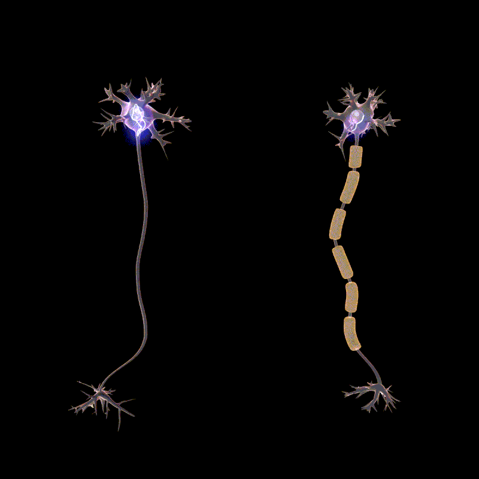

# George C. G. Barbosa 

<a itemprop="sameAs" content="https://orcid.org/0000-0003-3036-9899" href="https://orcid.org/0000-0003-3036-9899" target="orcid.widget" rel="me noopener noreferrer" style="vertical-align:top;">https://orcid.org/0000-0003-3036-9899</a>

I am a PhD student @ [The University of Arizona](https://www.cs.arizona.edu/person/george-cg-barbosa).
I am working with Low Orbit Satellite Networks.
Check this vis to understand more: [starlink-g1.gcgbarbosa.com](http://starlink-g1.gcgbarbosa.com).

---

## My stack

### Writing

### DevOps

### Cloud

### Tools

### Comunity help

### Learning

### Coding

#### Tools

#### Languages

#### System

## Also...

**[joincampaignzero.org/](https://joincampaignzero.org)**

**[blackinai.github.io/](https://blackinai.github.io/)**

**[stopbullying.gov/](https://www.stopbullying.gov/)**

